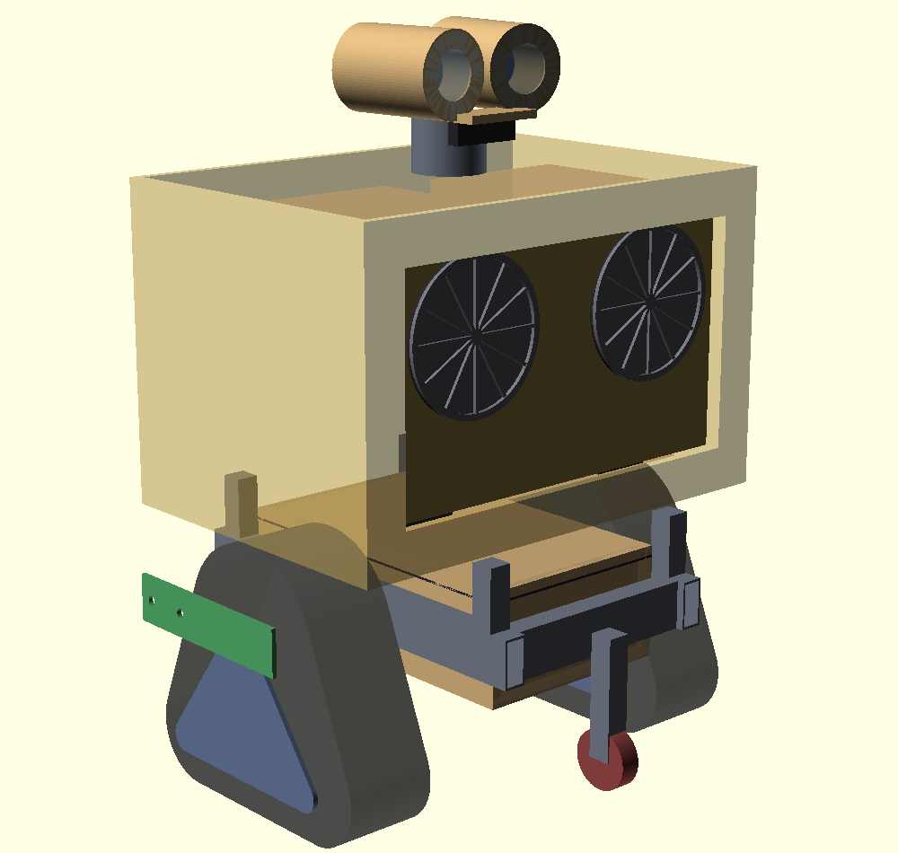
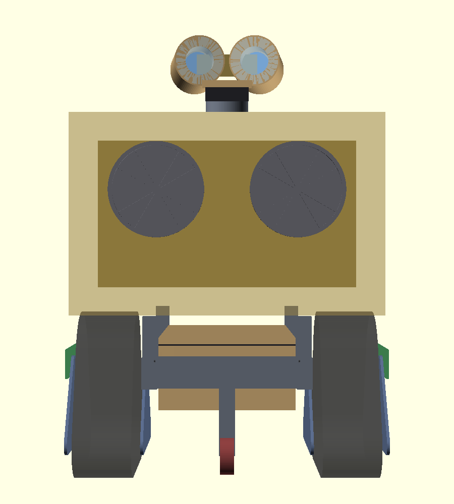
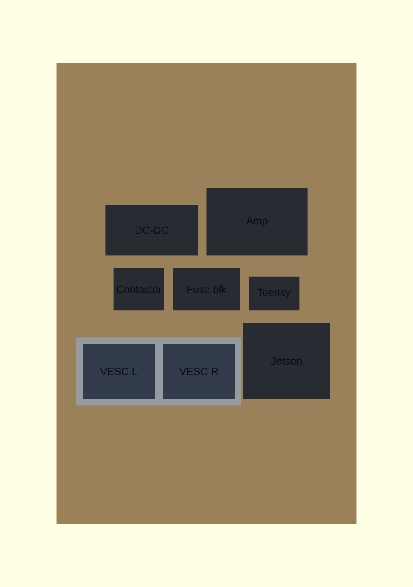
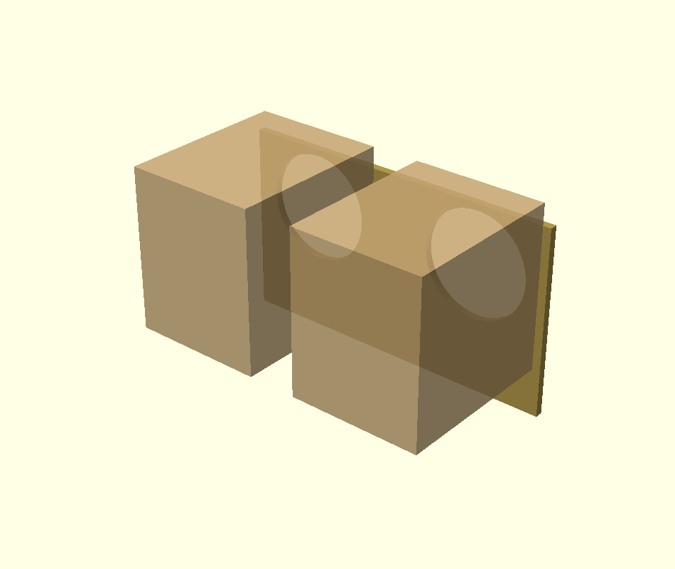
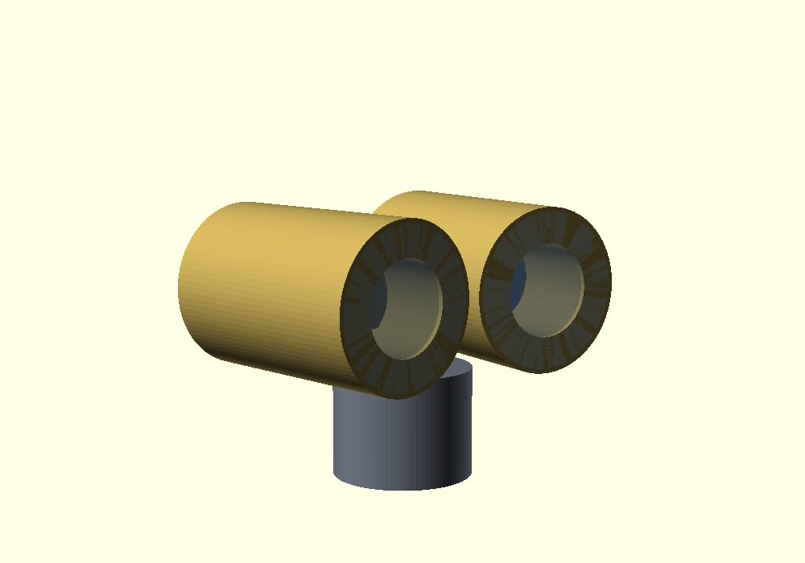

 # WALL-E

A two-track robot built from the two Rev 012 track pods, for Midburn in the Negev desert.

This folder holds everything for the robot: the documents, the code for three small
computers, and the CAD for the frame. Nothing in here changes the scooter project.
The scooter work stays in `../archive/`.

---

## Start here if you are building it

**[BUILD.md](BUILD.md)** — the steps in order, with a check at the end of each one.

The drawings it refers to are in `blueprint/`, and they are dimensioned:

| Sheet | What it is |
|---|---|
| [`blueprint/s1.png`](blueprint/s1.png) | General arrangement — overall sizes and every important height |
| [`blueprint/s2.png`](blueprint/s2.png) | Frame weldment — **this is the one the welder gets** |
| [`blueprint/s3.png`](blueprint/s3.png) | Battery box — the six plywood panels, flat |
| [`blueprint/s4.png`](blueprint/s4.png) | Chest panel — the two speaker holes |
| [`blueprint/s5.png`](blueprint/s5.png) | Electronics shelf — what goes where |

To redraw all of them after a change:

```sh
cd WALL-E && ./render_all.sh
```

It refuses to draw anything if the pod numbers or the 46 guards do not pass, so a
clean run is also the model's own check that the change is consistent.

### The files

| File | What it is |
|---|---|
| `walle.scad` | The global file. One entry point, every view and every sheet. |
| `pod_interface.scad` | The 23 facts about the **built** pods. The only place they live. |
| `check_pod_interface.scad` | Proves that file still agrees with the Rev 012 pod model. |
| `cad/walle_frame.scad` | Everything WALL-E decides, plus the 46 guards. |

The pod numbers used to be typed into `cad/walle_frame.scad` by hand, copied from
the pod model. They are now in one file, and `check_pod_interface.scad` compares all
23 of them against the pod model itself. As of 2026-09-16 all 23 agree.

Two things in there are still **assumptions, not measurements**, and both are in
step 0 of [BUILD.md](BUILD.md): whether the pods still have their green plates on,
and the part weights that the tipping angles are computed from.

---

## What we are building

Take the two track pods that were designed for the scooter. Instead of putting them one
behind the other like a motorbike, put them **side by side**, left and right. Then there is
no steering fork at all. To turn, you drive the left track faster than the right track. A
digger and a tank turn this way. WALL-E turns this way too.

On top of the two pods sits a box. Inside the box are the batteries, three small computers,
and two speakers. On top of the box is WALL-E's head, with two screens for eyes.

### How it is driven

A person holds a radio remote control and drives it. This is called **teleoperation**, or
teleop for short. The robot is *not* self-driving.

But the robot is not stupid either. Two things run on their own:

1. **A safety layer.** Sensors watch for obstacles. If something is close, the robot refuses
   to drive into it, even if the driver pushes the stick that way.
2. **A personality layer.** A camera finds people's faces. The eyes look at them, and the
   whole robot turns slowly to face them, because the head is rigid and does not move on its
   own. Sounds play. This is the part that makes people smile, and it is the reason to build
   the robot at all.

We chose this on purpose. A fully self-driving robot in a crowd of thousands of people, at
night, in dust, is both dangerous and much more work. And nobody in the crowd would even
notice good navigation. They *will* notice eyes that follow them.

---

## The three computers

The most important idea in this whole project: **do not use one computer.** Use three.

The three jobs have completely different speed requirements. Mixing them makes the robot
unsafe.

| Name | Board | Job | How fast must it be |
|---|---|---|---|
| **Brain** | Jetson Orin Nano | Camera, AI, sounds, deciding | Slow is fine: 0.1 to 3 seconds |
| **Spine** | Teensy 4.0 | Reads the remote, talks to the motors | Very fast and exact: 1000 times a second |
| **Face** | ESP32-S3 | The two eye screens. No servos — the head is rigid | Steady: 30 times a second |

The **Brain** runs Linux, like a normal computer. Linux is good at big jobs like AI, but it
has no promise about timing. It can freeze for two seconds and nobody notices. That is
fine for a camera. It is *not* fine for motors.

The **Spine** runs no operating system at all. Just one small program in a loop. It cannot
freeze. It holds the emergency rules. If the Brain stops talking to it, the Spine stops the
motors by itself.

The radio receiver and the emergency stop wire into the **Spine**, not into the Brain. So if
the Brain crashes, the driver keeps full control of the robot. You lose the eyes and the
sounds, and that is all.

The **Face** is separate so the eyes keep moving smoothly even when the Brain is busy. An
eye that stutters looks broken and ruins the illusion instantly.

---

## Folder guide

```
WALL-E/
  README.md                  <- you are here
  docs/
    00-plan.md               The master plan: status, phases, budget, schedule, risks
    01-architecture.md       How the three computers work together, and the safety rules
    03-safety-log.md         The safety test record. Fill in by hand before going near people
    04-power-and-wiring.md   Every wire, every fuse, and the emergency stop chain
    05-bom.md                What to buy, what it costs, how long it takes to arrive
    06-why-the-batteries-are-low.md   Why the packs hang under the frame, with the numbers
    99-glossary.md           Every technical word used here, explained simply
  firmware/
    README.md                How to build and flash both boards, and how to test them
    spine/                   The Spine: motor commands and every safety rule
    face/                    The Face: eye animation. One board per eye
  brain/
    README.md                How to run it, and the three load-bearing ideas in it
    main.py                  The 20 Hz control loop
    test_safety.py           Invariant checks. Runs with no dependencies
  cad/
    walle_frame.scad         The whole robot. Parametric, with 46 guards
    walle_robot_*.png        The robot with body and head
    walle_head.png           The eye barrels
    walle_shelf.png          The electronics layout, labelled
    walle_frame_*.png        The bare frame, and the plywood cutting layout
```

---

## The model

`cad/walle_frame.scad` is the whole robot: the frame, the two pods, the batteries, the body,
the head and the electronics layout. Run it and it prints every dimension, the cut list, the
tipping angles, and 46 checks that all have to pass.

```bash
openscad -o walle.stl -D 'render_mode="robot"'    cad/walle_frame.scad   # everything
openscad -o steel.stl -D 'render_mode="frame"'    cad/walle_frame.scad   # steel only, for welding
openscad -o cut.dxf   -D 'render_mode="plates"'   cad/walle_frame.scad   # plywood, flat
openscad -o head.stl  -D 'render_mode="head"'     cad/walle_frame.scad   # the eye barrels
openscad -o chest.stl -D 'render_mode="chest"'    cad/walle_frame.scad   # speakers + enclosures
openscad -o sec.stl   -D 'render_mode="section"'  cad/walle_frame.scad   # cut open
```



From the front. The body is narrower than the track span on purpose, so the pods stay proud
at the sides — that is what makes the silhouette read as WALL-E rather than as a box on
wheels.



| Headline number | Value |
|---|---|
| Overall width | 672 mm (pods 500 apart, green plates stick out either side) |
| Overall height | 910 mm, to the top of the eye barrels |
| Body | 430 long × 620 wide × 400 tall, floor at 335 mm |
| Rails | 60×30×3 box, 550 long, 268 mm clear between them |
| Lowest point of the robot | 150 mm above the ground |
| Whole robot | 88.9 kg — **the pods, packs and electronics are still guesses** |
| Centre of mass | 318.2 mm up, and 4.4 mm forward of centre — the chest speakers |
| Ground pressure | 0.163 kg/cm² over 546 cm² |
| Tips forward at | 19.3° of pitch (backward 20.7°) |
| Anti-tip castor catches at | 12.3° — so it catches 7.0° before the robot goes over |
| Steel needed | 1580 mm of 60×30×3 box tube |

**The pod comes off with two bolts per side.** The frame reuses the four M12 holes that are
already drilled in the green plates, so no new holes go into the built pods.

The tipping numbers are only as good as the mass guesses feeding them. Weigh a pod, weigh a
pack, and put the real numbers in the model before trusting 19.3°.

### Four things the model settled

**There is no room for electronics in the frame.** The interior is almost entirely battery:
8 mm above the packs, 24 mm between them, 13 mm to the cross members. So everything moved
onto a shelf inside the body. It fits four rows and uses 40 % of the shelf area, which
leaves room for the speakers and an air path.



**The body floor has to clear the belt crown, not the frame.** The pods are 327 mm tall at
the top of the belt but the frame only reaches 257, so the body sits on four risers 78 mm
tall. Miss this and the shell grinds on a moving belt.

**The battery box has to be a closed box, and it was not one.** It was a three-sided U,
open across the top and at both ends, hanging right where the belts throw sand. It is now
six panels with a gasketed lid, plugs in the spanner holes, and a membrane vent — a sealed
box breathes with the day/night temperature swing and pulls dust in through its worst leak,
so it needs a clean air path. The packs charge in place through a connector on the outside
of the body and never come out in the field.


Why the packs stay low rather than going in the body, with the numbers:
[`docs/06-why-the-batteries-are-low.md`](docs/06-why-the-batteries-are-low.md).

**The chest panel was a hole, not a panel.** `chest_d` recesses the chest 20 mm into a
12 mm wall, so the recess cut the front wall clean away and you could see the electronics
through WALL-E's chest. It is now a real 12 mm plate set back 20 mm — which is lucky,
because that plate is exactly what the speakers needed to mount to.

### The speakers

Two 6.5 inch drivers in the chest panel, 280 mm apart, 584 mm above the ground. That is how
WALL-E talks and plays music.


**Each driver gets its own sealed plywood enclosure, 9.8 litres.** They do not fire into
the body, and that is deliberate. The body is not airtight — it has a filtered air intake,
a removable lid and cable entries — so an open back would chuff and lose all its bass. And
100 W of pressure swinging around the electronics bay shakes every connector on the shelf.



Two things the model flagged that are easy to miss:

**The enclosures shade 54 % of the electronics shelf.** They clear it by 20 mm, so nothing
clashes, but they sit above it. So they **bolt** to the chest panel — glue them in and
half the electronics becomes unreachable.

**They cost about 1.5° of forward tipping margin.** 7.3 kg at 584 mm, and both of them forward
of centre, which pulls the centre of mass 4.4 mm towards the direction the robot already tips.
With them fitted the robot tips forward at 19.3°, and the castor still catches 7.0° before
that. It passes, but the speakers are one of several things pushing that number down, so weigh
the real parts before adding another.

### The head

Two 105 mm barrels, 128 mm apart, toed in 6°, each with a 2.1 inch round screen recessed
60 mm behind a clear dome.



The recess is not styling, it is a sun shade: a screen that deep behind a 53 mm aperture is
in shadow for any sun above 49° elevation, and Negev midday sun is 75–80°. The dome seals
the barrel against dust.

**New to this? Read in this order:** `99-glossary.md`, then `00-plan.md`, then
`01-architecture.md`. Do not start buying parts until you have read the plan, because the
parts list only makes sense after it.

---

## What we already have

**Both pods are built, to Rev 012.** The belts are fitted and both hub motors are in hand,
along with the original scooter controllers. Nothing electronic exists yet, and the frame that
holds the two pods side by side has not been designed — that is the first job.

These numbers come from the Rev 012 model, which the pods were built to. Confirm the first one
with a tape measure before the frame is welded, because it is the dimension the frame has to
match.

| Thing | Value |
|---|---|
| **Green plate outer faces — the frame mounting width** | **172 mm** |
| Ground contact, one pod | 231 mm long × 118 mm wide |
| Pod size | 363 long × 327 tall × ~200 wide |
| Where the pod bolts to the frame | A plate 60 mm tall, 197–257 mm above the ground |
| Suspension travel | +30.7 mm up, −29.2 mm down |
| Ground pressure at 100 kg total | 0.18 kg/cm² |
| Belt movement per motor turn | 660 mm |

See `../archive/rev012-inline-batteries/` for where these come from.

That last ground pressure number is worth understanding. Your own foot presses the ground at
roughly 0.5 kg/cm². This robot, at 100 kg, presses **less than a third as hard as a walking
person**. That is why tracks are the right choice for desert sand, not just a nice look.

---

## Open questions

Full list with deadlines in `docs/00-plan.md` section 4. The three that matter most:

1. **Both pack capacities, in Ah, and are both BMS units healthy?** This sets the runtime and
   the fuse sizing. Since decision D8 gave the electronics their own battery, the two traction
   packs want to be the **same** capacity — see `docs/00-plan.md` decision D4.
2. **Does WALL-E carry a person?** If yes, the frame is heavier and it must be registered as
   a mutant vehicle with Midburn. Check the current Midburn rules before the frame is welded.
3. **How do we stop it tipping forward?** The pods put only 231 mm of track on the ground, so
   that is the robot's whole front-to-back footprint. Longer belts are no longer an option
   now the pods are assembled, so the plan is anti-tip wheels plus keeping every heavy thing
   as low as possible.
