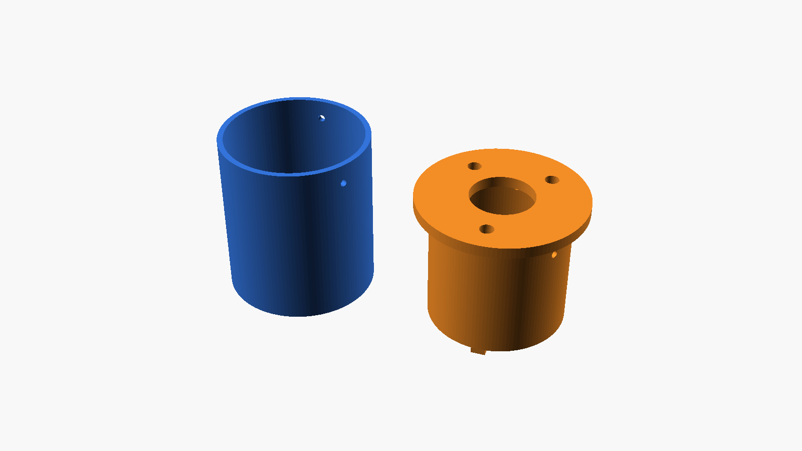
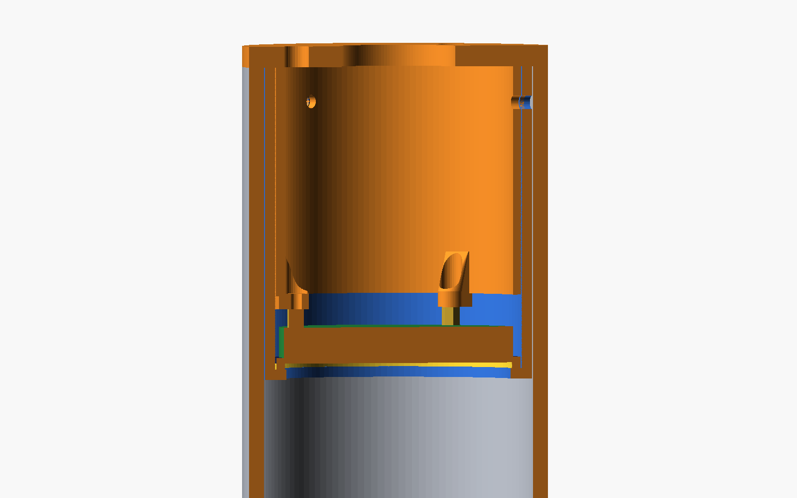

# WALL-E eyes — steel tube + printed cartridge

Decided with Shahar, 2026-10-01. One eye = one steel tube + one cartridge.





## Decisions

- **Tube:** steel, **54 mm inside × 90 mm long** (owner's). Outside Ø: **measure**.
- **Screen + computer:** Waveshare **ESP32-S3-Touch-AMOLED-1.75**: round AMOLED
  466×466, 700 nits, ESP32-S3R8 on the back. Touch not used.
  - Bought: 2 × standard + 1 × **-G** (GPS version). The GPS board is one eye
    and the GPS. One standard board is the spare.
- **Sun shade:** glass front sits **33 mm deep**. Paint the inside of the tube
  **matte black**.
- **Mount:** 2 printed parts. The board screws onto part 2 with **3 × M2**
  into its own brass posts. The eye is built on the table, then slides into the
  tube. **3 × M3** from outside hold it.
- **Wires:** the USB-C is on the board edge, facing the tube wall: no room for a
  plug. Use the **header on the back** instead (see Wiring).
- **AMOLED burns in:** the eyes must always move a little, and turn off in sleep.

## Board numbers (Waveshare 3D model)

Measured from the glass front, along the axis:

| What | Size / depth |
|---|---|
| Glass | Ø48.96, 1.10 thick |
| Picture (visible) | Ø44.16 |
| Board | Ø46.0 |
| USB-C (edge, r 23.8) | ends 10.15 behind the glass |
| 3 brass posts, M2, Ø3.5 | tips 10.43 behind the glass; at (±13.75, 14.70) and (0, −20.50), header side up |
| Header (female, 8 pins) | ends 12.70 behind the glass |

## Parts per eye

| # | Part | Size | Source |
|---|---|---|---|
| 1 | Steel tube | 54 inside × 90 | owned |
| 2 | Matte black paint inside, front ~35 mm | steel primer + flat black | local |
| 3 | **Part 1** (`eye_part1.stl`): sleeve + front lip | outside 53.6, inside 49.5, lip hole 45, 60 long | print |
| 4 | Foam ring | outside 49, hole 45.5, ~1.5 mm | cut from closed-cell (EPDM) foam sheet |
| 5 | Eye board | Waveshare AMOLED 1.75 | bought |
| 6 | **Part 2** (`eye_part2.stl`): carrier tube + cap | outside 49.1, cap Ø = tube outside | print |
| 7 | 3 × **M2×6** screw | board posts → part 2 | local / AliExpress |
| 8 | 3 × **M3** self-tapping screw, ~8 mm | steel + part 1 + part 2 | local |
| 9 | **PG16** cable gland, black | in the cap, hole 22.8 | AliExpress |
| 10 | Silicone sealant | gland + the 3 screwdriver holes in the cap | local |
| 11 | 4 wires: Dupont male → header; 4-core shielded 24 AWG | VBUS, GND, TXD, RXD | AliExpress |
| GPS eye only | IPEX → SMA pigtail 20 cm, SMA extension 50 cm, QUESCAN antenna | antenna under the head top cover | bought |

## Print

- **PETG or ASA, black.** Not PLA (soft at ~55 °C; steel in the sun gets hotter).
- 4+ walls, 40 % infill (the screws go into it). No supports.
- Part 1: lip down. Part 2: the STL is already cap down.
- Print **3 sets** (2 eyes + 1 spare).
- Re-export after a change:
  ```
  openscad -D part=\"p1\" -o eye_part1.stl eye_cartridge.scad
  openscad -D part=\"p2\" -o eye_part2.stl eye_cartridge.scad
  ```

## Assembly (per eye)

1. GPS board only: unplug the small antenna (IPEX plug next to the USB-C, lift
   straight up), unscrew it. Plug the pigtail into the same socket.
2. Program the board once on the table, with a normal USB-C cable.
3. Plug the 4 wires into the header (male Dupont). Drop of hot glue on them.
4. Wires (and the pigtail) through the PG16 gland in the part 2 cap.
5. Board onto the 3 pads of part 2. **3 × M2×6** through the 3 screwdriver holes
   in the cap. Do not overtighten: the posts are small.
6. Stick the foam ring on the back of the part 1 lip.
7. Part 2 (with the board) into part 1, glass first, until the glass touches the foam.
8. Whole cartridge into the painted tube from the back, until the cap sits on the tube end.
9. Drill 3 × 3.2 mm through the steel at the 3 holes (7 mm from the end).
   Drive 3 × M3 self-tapping screws.
10. Tighten the gland. Seal the gland and the 3 screwdriver holes with silicone.

**Repair:** cut the silicone, remove 3 × M3, pull the cartridge out.

## Wiring

Header on the back: `IO18 · IO17 · IO16 · RXD · TXD · 3V3 · GND · VBUS`

| Eye pin | Goes to |
|---|---|
| VBUS | +5 V from the RCNUN 12→5 V converter |
| GND | GND (converter and CP2102) |
| TXD | CP2102 **RXD** |
| RXD | CP2102 **TXD** |

- The CP2102 plugs into the USB hub. Leave its +5V and 3V3 pins empty.
- GPS board: IO17 / IO18 belong to the GPS. Do not use them. The eye firmware
  forwards the GPS data on TXD/RXD.

## Files

| File | What |
|---|---|
| `eye_cartridge.scad` | the 2 parts. `part = "p1" / "p2" / "all" / "cut"` |
| `eye_part1.stl`, `eye_part2.stl` | ready to print |
| `eye_cartridge_parts.png` | the 2 parts |
| `eye_cartridge_cut.png` | assembled, cut in half |

## Still open

- Tube **outside Ø** → set `tube_od` (now 60, a guess) and re-export part 2.
  It only changes the cap's outer edge. Part 2 works as it is.
- Check the real board when it arrives (post positions, header height), before
  printing all 3 sets. Print 1 set first.
- Firmware: `firmware/face` is written for the old 2.1" screen. The new board uses
  a CO5300 driver (QSPI). Start from Waveshare's example code for this board.
- `cad/walle_frame.scad` and `docs/02-overview.md` still describe the old eye
  (Ø99 barrel, 60 mm recess, acrylic dome).
